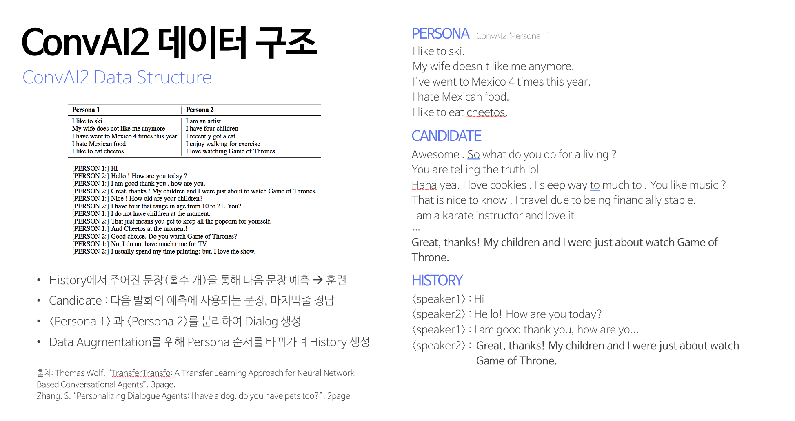
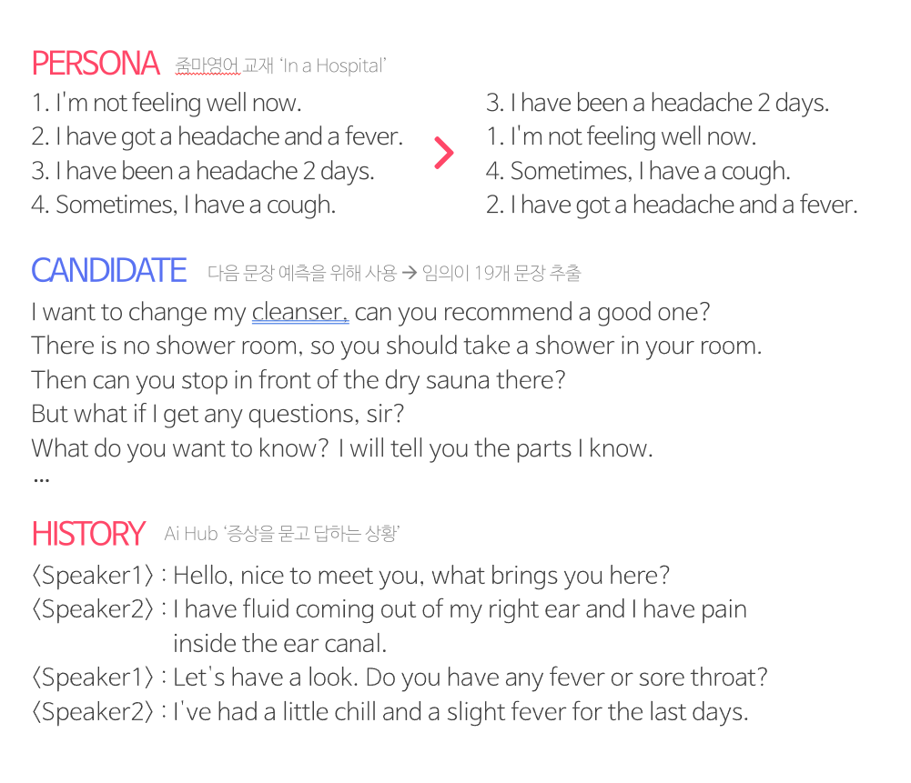

# Conversational AI for Education
> The conversational AI chatbot app using pre-trained OpenAI GPT-2 model for
beginners who want to learn English. I mainly used  [Hugging Face's](https://github.com/huggingface/transfer-learning-conv-ai) training code which used transfer Learning from an OpenAI GPT and GPT-2 Transformer language model.

## Demo
You can click [here](https://youtu.be/wQf57Zkly0A) to view the full demo video.

### Chat with Voice Recognition

 

### AFL

 

### Quiz

## Introduction
- Presentation [ [slide](https://drive.google.com/file/d/1aKTveAp5rdqOjbpVT-CFu0GioQ4GMEt1/view?usp=sharing) | [video](https://youtu.be/eyggIxctkF0) ]

- Summary paper [ [kor](https://drive.google.com/drive/u/0/folders/1y1SoWDfAhpzr551PpXJm3POBo7b3WKCb) | [eng](https://drive.google.com/file/d/105vMI1IkXChRjkYUAzhL9lGUbG5zzY4i/view?usp=sharing) ]

## Project Process

## Dataset
### ConvAI2 Data

### Project Data

## Models
### Conversational AI
- Open AI GPT
- Open AI GPT2

### AFL
> AFL stands for Assessment For Learning. This word to refer to a way of evaluating users on an achievement basis, away from traditional learning evaluation methods.

Therefore, the project aimed to score user evaluations for continuous learning and motivation using MRPC, CoLA dataset, and Spell Check API.

- MRPC(Microsoft Research Paraphrase Corpus)
- CoLA(Corpus of Linguistic Acceptability)
- Bing Spell Check API 

## Parameter Optimization

| **Argument**                | **Default value** | **Modified Value** |                       **Description**                        |
| :-------------------------- | ----------------- | ------------------ | :----------------------------------------------------------: |
| Model                       | Open AI GPT       | **GPT2**           |                      Open AI GPT, GPT2                       |
| Num_candidates              | 2                 | **6**              |              candidate group for Next Utterance              |
| Max_history                 | 4                 | **2**              |       Number of previous utterances to keep in history       |
| Gradient_accumulation_steps | 8                 | **4**              | Used to troubleshoot memory problems on GPU during Optimization |
| Epochs                      | 1                 | **30**             |                       Number of Epochs                       |
| Train_batch_size            | 4                 | **2**              |                   Batch size for training                    |
| Valid_batch_size            | 4                 | **2**              |                  Batch size for validation                   |

## Evaluation

## Reference
